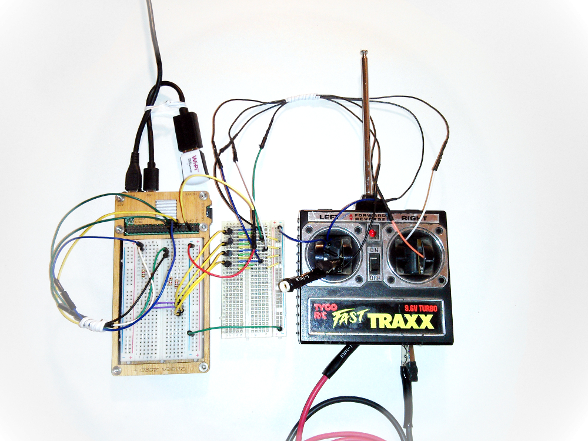

<a href="https://karlherrick.com/2020/05/30/fast-traxx-pi/">fast-traxx-pi</a>
======

Using a Raspberry Pi's GPIO pins to drive the remote control of a Tyco Fast Traxx.

<a href="https://www.youtube.com/watch?v=tDzMHCWF2u0">
  
</a>

## Use git to clone this package
```bash
git clone https://github.com/kherrick/fast-traxx-pi.git \
  && cd fast-traxx-pi
```
## Use npm to install and run the script
```bash
npm i \
  && npm start
```
